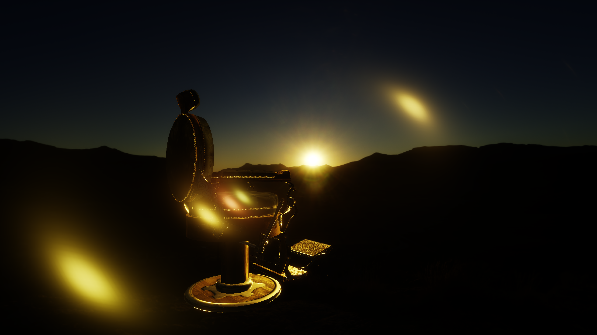
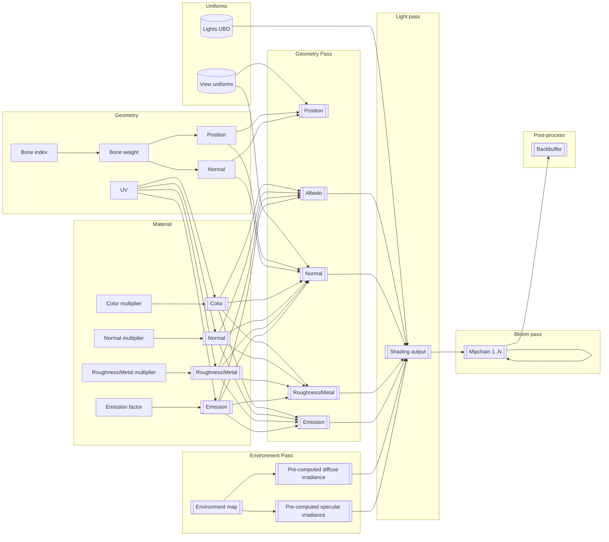

# Projet Informatique Graphique 3

Ce projet est une implémentation d'un moteur graphique avec rendu de type deffered,
dans une pipeline HDR avec un modèle d'irradiance à microfacettes.

Codé en Rust, il utilise OpenGL 3.3 core et devrait normalement pouvoir compiler sans dépendance
supplémentaire (OpenGL est évidemment requis, ainsi qu'une toolchain Rust).
Il a été testé sous Windows (toolchain GNU) et Linux. Rien n'est spécifique à la toolchain GNU Windows
de Rust, la toolchain MSVC doit marcher aussi.

## Structure

Le projet est structuré selon plusieurs dossiers à la racine :

- `assets` sont les données externes et ne contiennent pas de contenu original - ils sont là pour pouvoir être
  chargés par les binaries.
- `bin` contient les projets (`crates` en jargon Rust) qui produisent des exécutables, qui servent à
  montrer plusieurs aspects du projet. En particulier, les binaires `sandbox` et `load_gltf` sont notables, car
  permettent de montrer le pipeline de rendu en son complet. Ils sont resp. un pseudo-éditeur de scène et un
  visualiseur de fichiers GLTF
- `lib` sont les différentes bibliothèques qui amènent différents niveaux d'abstractions, ainsi que les
  fonctionnalités principales du projet. En particulier, `violette` est la bibliothèque d'abstraction OpenGL,
  fournissant des objets RAII et une API *safe* et "bindless" autour d'OpenGL.
- `res` est le répertoire des ressources internes du projet, notamment les sources des shaders en GLSL. Une
  couche de modularité a été ajoutée par le biais d'un pré-processeur personnalisé (situé dans `lib/glsl-preprocessor`)
  pour permettre les `#include`. Ceci a été fait surtout pour réutiliser des définitions d'uniform blocks à
  travers plusieurs shaders.

## Pipeline de rendu

Le rendu d'objets se fait via une architecture `deffered` qui sous-traite l'éclairage en se servant des données
suivantes :

- Position
- Albedo
- Normales + "Coverage" (texture `GL_RGBA32F` avec l'alpha mis à 1 lors de l'écriture, pour servir de masque
  lors de la passe defferée)
- Roughness/Metal (packée dans une texture `GL_RG32F`)
- Emission

Chaque mesh possède une information de position, normale et UV. Chaque matériau possède à la fois une texture
et un facteur indépendant qui écrit dans ces textures. Ceci est fait par les
shaders [mesh.vert.glsl](res/shaders/mesh/mesh.vert.glsl)
et [mesh.frag.glsl](res/shaders/mesh/mesh.frag.glsl), la définition d'un Vertex est faite dans
[material.rs](lib/rose-renderer/src/material.rs) et celle de l'uniform `View` dans
[camera.rs](lib/rose-core/src/camera.rs). À noter que le `derive(VertexAttributes)` est une macro personnalisée définie
dans [violette-derive](lib/violette-derive/src/lib.rs).

Le calcul de l'éclairage se fait en itérant côté CPU sur les lumières, en avançant un curseur sur l'UBO des
lumières qui ont été auparavant envoyées au GPU (dans `sandbox`, une détection des changements permet de mettre
à jour ce buffer automatiquement lors d'un changement d'un composant touchant à une lumière). L'éclairage par
l'environnement est une étape à part qui utilise des textures d'irradiance diffuse et spéculaire qui sont calculées
au chargement de la carte d'environnement (dans `sandbox` et `load_gltf`, il suffit de glisser une texture sur la
fenêtre pour la changer et refaire ces calculs).  
L'éclairage par environnement se fait dans [equirectangular.glsl](res/shaders/screen/env/equirectangular.glsl), avec la
génération des cartes d'irradiance [diffuse](res/shaders/screen/env/irradiance.glsl) et
[spéculaires](res/shaders/screen/env/specular_ibl.glsl).

Une étape de post-processing est enfin appliquée afin de combiner le bloom, de lens flares et de dessiner la scène à
l'écran, appliquer un opérateur de
tonemapping (ACES Fitted), dont le shader est défini dans [postprocess.glsl](res/shaders/screen/postprocess.glsl).

Une étape de génération de bloom est ajoutée pour donner une impression d'éblouissement, et parce que c'est la seule
*vraie* raison de faire un pipeline HDR. Elle se base sur un pull push décrite
[dans cet article](https://learnopengl.com/Guest-Articles/2022/Phys.-Based-Bloom), et est implémentée côté CPU dans
[blur.rs](lib/rose-renderer/src/postprocess/blur.rs), et côté GPU
avec [downsample.glsl](res/shaders/screen/blur/downsample.glsl)
et [upsample.glsl](res/shaders/screen/blur/upsample.glsl).

## Ce qui n'a pas marché

### SSAO

Il y a une branche dans le dépot Git concernant une implémentation d'un SSAO. Le principal problème non-résolu à temps
concerne le fait que l'occlusion semble se "renverser" selon la position de la caméra.

### Mesh skinning

Une erreur *quelque part* fait que les index vers les matrices de transformation ne sont pas bien passées
(le format reçu par OpenGL est incorrect pour l'index alors que l'attribut est bien mis en `GL_UNSIGNED_INT`). Le
résultat est que les indices doivent être codés dans le shader pour avoir une déformation.

### Transparence

Par manque de temps, la transparence n'a pas été considérée.